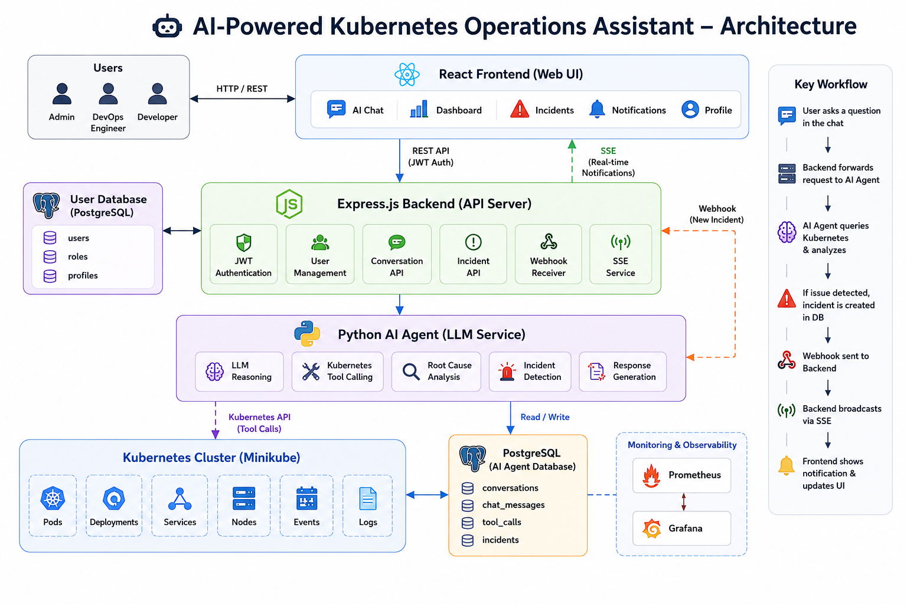
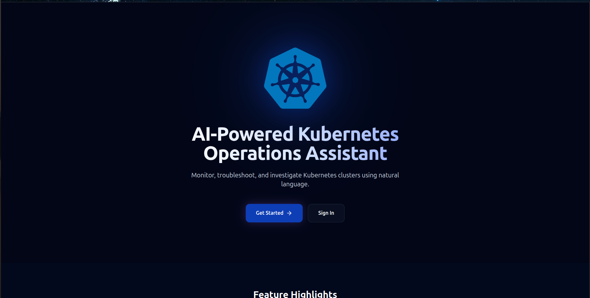
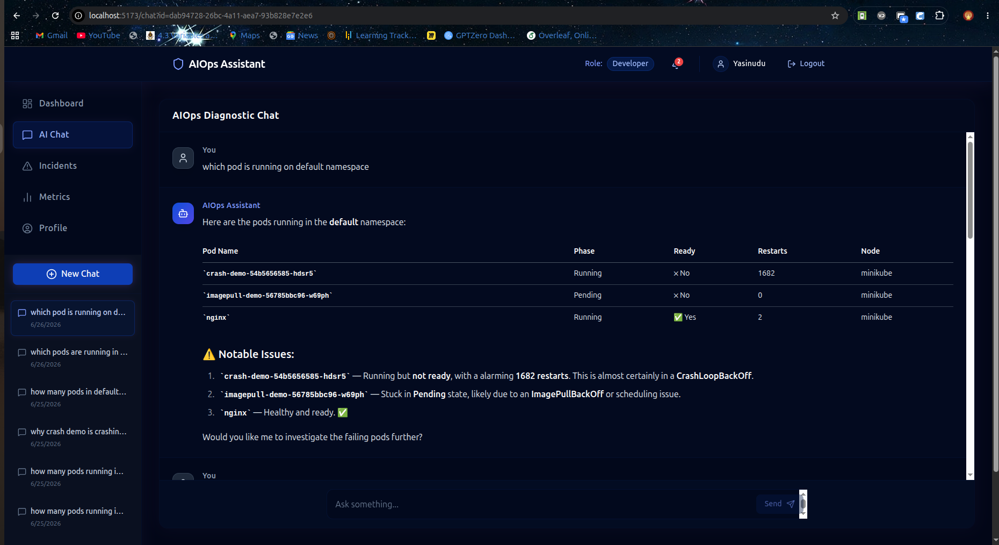
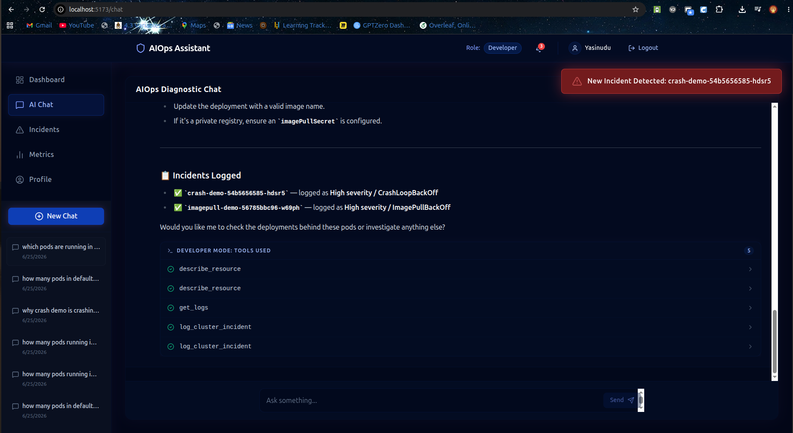
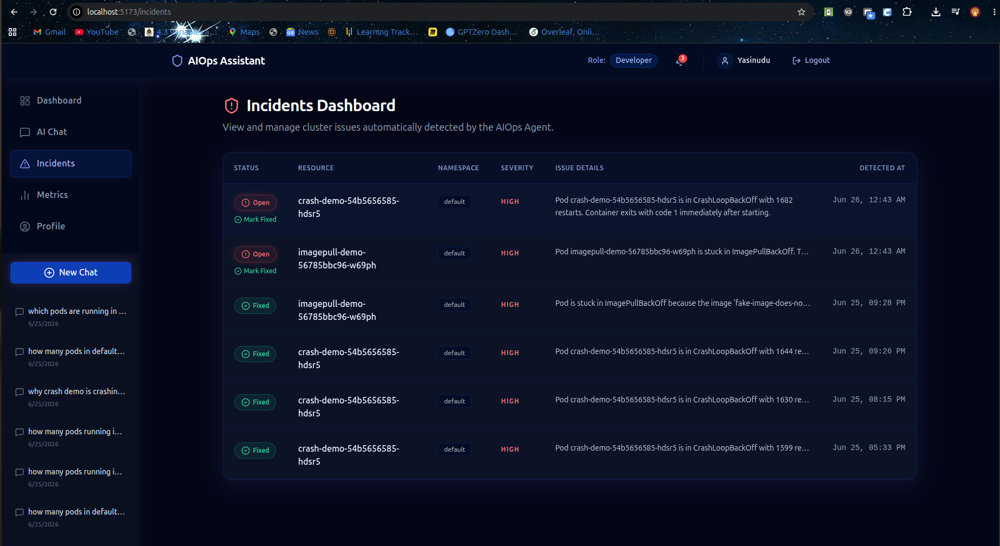
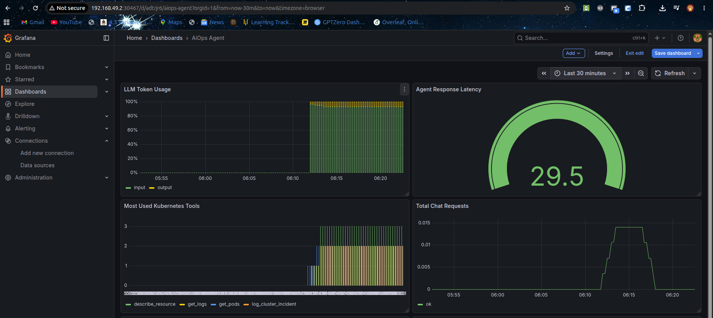

# 🚀 AI-Powered Kubernetes Operations Assistant

An AI-powered AIOps platform that enables DevOps teams to monitor Kubernetes clusters, diagnose failures through natural language conversations, manage incidents, and receive real-time notifications.

Demo Link :- [https://www.youtube.com/watch?v=R4KLq3zCNtg](https://www.youtube.com/watch?v=R4KLq3zCNtg)

---

## ✨ Highlights

🔍 **AI-Powered Cluster Diagnostics**

- Troubleshoot Kubernetes issues using natural language.
- Automated root cause analysis for cluster failures.
- AI-generated incident summaries and recommendations.

⚡ **Real-Time Incident Detection**

- Detect CrashLoopBackOff, ImagePullBackOff, OOMKilled, and other failures.
- Automatic incident creation and tracking.
- Deduplication using incident fingerprinting.

🔔 **Live Notifications**

- Real-time incident alerts using Server-Sent Events (SSE).
- Dynamic notification bell updates.
- In-app toast notifications.

🛡️ **Role-Based Access Control**

- JWT Authentication.
- Admin, DevOps Engineer, and Developer roles.

📊 **Operational Dashboard**

- Cluster overview.
- Incident management dashboard.
- Chat history and diagnostics timeline.

---

## 🏗️ System Architecture



---

## 🎯 Key Features

### 🤖 AI Chat Assistant

Ask questions such as:

```text
Check cluster health
Why is my pod restarting?
Analyze deployment issues
Show node status
```

The AI agent automatically gathers Kubernetes data, analyzes the cluster, and provides actionable recommendations.

---

### 🚨 Incident Management

The platform automatically:

- Detects operational issues.
- Creates incidents.
- Prevents duplicate active incidents.
- Tracks incident lifecycle.
- Maintains historical incident records.

Supported states:

```text
OPEN → ACKNOWLEDGED → RESOLVED
```

---

### 🔄 Real-Time Notification Pipeline

```text
Incident Detected
        │
        ▼
Python Agent
        │
        ▼
Webhook
        │
        ▼
Express Backend
        │
        ▼
SSE Broadcast
        │
        ▼
React Frontend
```

Users instantly receive:

- 🔔 Notification Bell Updates
- 📢 Toast Notifications
- 📋 Incident Dashboard Updates

---

## 🛠️ Tech Stack

| Category           | Technologies                      |
| ------------------ | --------------------------------- |
| Frontend           | React, React Router, Tailwind CSS |
| Backend            | Node.js, Express.js               |
| AI Agent           | Python, LLM Integration           |
| Database           | PostgreSQL                        |
| Container Platform | Kubernetes                        |
| Monitoring         | Prometheus, Grafana               |
| Authentication     | JWT                               |
| Notifications      | SSE (Server-Sent Events)          |

---

## 📂 Project Structure

```text
project-root/

├── frontend/
├── backend/
├── agent/
├── kubernetes/
└── database/
```

---

## 📸 Screenshots

Add screenshots here after completing the UI.

### Front Page



### AI Chat Assistant



### AI Real Time Incident Detect



### Incident Dashboard



### Application Metrics Dashboard



---

## 🚀 Future Improvements

- Email Notifications
- Slack / Microsoft Teams Integration
- Multi-Cluster Support
- Predictive Failure Detection
- AI-Generated Remediation Plans
- Redis Caching
- Advanced Incident Analytics

---

## 📚 Learning Outcomes

This project demonstrates practical experience in:

- Kubernetes Operations
- AIOps
- Incident Management
- Full-Stack Development
- Event-Driven Architectures
- Real-Time Notification Systems
- PostgreSQL Database Design
- Authentication & Authorization
- Monitoring & Observability

---

## ⭐ Project Goal

Build an intelligent Kubernetes operations platform that helps engineers detect, diagnose, and resolve infrastructure issues faster through AI-assisted workflows and real-time operational visibility.

-- create unique index

CREATE UNIQUE INDEX unique_open_incident ON incidents (fingerprint) WHERE status = 'open';
