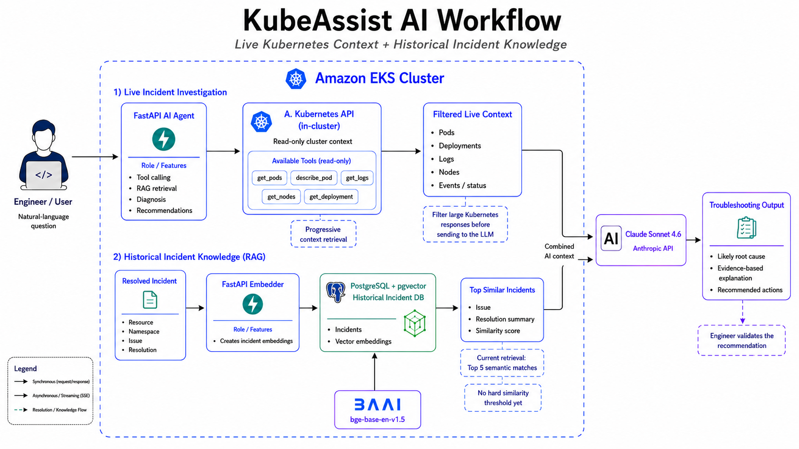

# KubeAssist AI

[Quick Guidance to Test the System (PDF)](https://drive.google.com/file/d/1ZAKRN1gHOb2gQJSg6rE40iOKgWVpwQAj/view?usp=sharing)

**AI-Powered Kubernetes Troubleshooting Assistant**

KubeAssist AI helps engineers investigate Kubernetes incidents by combining **live Kubernetes context**, **historical incident knowledge using RAG**, and **Claude-based AI reasoning**.

The system is designed to reduce the amount of manual investigation required before an engineer can understand a Kubernetes issue and decide what action to take.

> **Current safety boundary:** KubeAssist AI has read-only Kubernetes access. It can investigate and recommend actions, but it does not automatically modify cluster resources.

---

## Table of Contents

- [Project Overview](#project-overview)
- [Problem](#problem)
- [Solution](#solution)
- [Key Features](#key-features)
- [Architecture](#architecture)
- [Technology Stack](#technology-stack)
- [AI Investigation Flow](#ai-investigation-flow)
- [RAG Workflow](#rag-workflow)
- [Token and Context Optimization](#token-and-context-optimization)
- [Prerequisites](#prerequisites)
- [Environment Configuration](#environment-configuration)
- [Database Setup](#database-setup)
- [Running Locally](#running-locally)
- [Kubernetes Access](#kubernetes-access)
- [Running on Amazon EKS](#running-on-amazon-eks)
- [Testing](#testing)
- [RAG Validation](#rag-validation)
- [SSE Validation](#sse-validation)
- [Security](#security)
- [Current Limitations](#current-limitations)
- [Future Roadmap](#future-roadmap)
- [Project Links](#project-links)
- [Author](#author)

---

# Project Overview

Kubernetes provides useful troubleshooting information through Pod states, logs, events, Deployments, Nodes, and other resources. The challenge is that engineers often need to collect these pieces separately and correlate them before identifying the actual root cause.

KubeAssist AI provides a chat-based troubleshooting experience. An engineer can ask a natural-language question such as:

```text
Why is my Pod in CrashLoopBackOff?
```

The system can then:

1. Inspect the live Kubernetes cluster using read-only tools.
2. Decide which tool is needed next based on the investigation.
3. Drill down into the affected resource.
4. Retrieve similar previously resolved incidents through RAG.
5. Send live Kubernetes evidence and historical knowledge to Claude Sonnet 4.6.
6. Return a likely root cause, explanation, and recommended actions.
7. Create an incident when the AI determines that the issue should be logged.
8. Notify the frontend in real time using Server-Sent Events.
9. Store verified human resolutions as future historical knowledge.

---

# Problem

When Kubernetes shows a symptom such as:

```text
CrashLoopBackOff
```

it tells the engineer that a workload is repeatedly failing, but it may not directly reveal the real reason.

The engineer may need to check:

```bash
kubectl get pods
kubectl describe pod <pod-name>
kubectl logs <pod-name>
kubectl get events
kubectl get deployment
kubectl get nodes
```

The actual cause may be:

- OOMKilled
- Application crash
- ImagePullBackOff / ErrImagePull
- Configuration error
- Failed scheduling
- Missing configuration
- Node-related issue
- Other application or infrastructure failures

The information is available, but collecting and connecting it takes time and Kubernetes knowledge.

---

# Solution

KubeAssist AI changes the troubleshooting flow from manual investigation to AI-assisted investigation.

```text
Engineer
   |
   v
Natural-language question
   |
   v
KubeAssist AI
   |
   +------------------------------+
   |                              |
   v                              v
Live Kubernetes Context      Historical Incident Knowledge
   |                              |
   +---------------+--------------+
                   |
                   v
            Claude Sonnet 4.6
                   |
                   v
Likely Root Cause + Explanation + Recommended Actions
```

The engineer remains responsible for validating and applying the actual remediation.

---

# Key Features

## Natural-Language Troubleshooting

Users can investigate Kubernetes issues using normal questions instead of beginning with many manual `kubectl` commands.

## Read-Only Kubernetes Tool Calling

The AI Agent can use tools such as:

- `get_pods`
- `describe_pod`
- `get_logs`
- `get_nodes`
- `get_deployment`

## Claude Reasoning

The main LLM is **Claude Sonnet 4.6**, accessed through the **Anthropic API**.

Claude receives the user question together with live Kubernetes evidence and, when available, historical incident context.

## Incident Management

KubeAssist can create incidents containing information such as:

- Resource name
- Namespace
- Severity
- Issue
- Status
- Resolution summary

Incident creation is triggered when the AI decides to call the incident logging tool during the troubleshooting flow.

## Real-Time Notifications

When an incident is created, the backend pushes a notification to the frontend using **Server-Sent Events (SSE)**.

## Historical Incident RAG

Resolved incidents are stored as historical knowledge and can be retrieved during future similar investigations.

## Chat History

Previous conversations are stored so users can view earlier troubleshooting interactions.

## Amazon EKS Deployment

The current system has been deployed and tested on **Amazon Elastic Kubernetes Service (EKS)**.

---

# Architecture


The main components are:

```text
User
 |
 v
React + Vite Frontend
 |
 v
Node.js + Express Backend
 |
 v
FastAPI AI Agent
 |              \
 |               \
 v                v
Kubernetes API   Claude Sonnet 4.6
 |
 v
Read-Only Kubernetes Tools

Node.js Backend
 |            \
 v             v
User DB       Incident DB
PostgreSQL    PostgreSQL + pgvector

Resolved Incident
 |
 v
FastAPI Embedder
 |
 v
BAAI/bge-base-en-v1.5
 |
 v
PostgreSQL + pgvector
```

## Frontend

Built with:

- React
- Vite

Responsibilities:

- Authentication UI
- Chat interface
- Incident dashboard
- Incident resolution
- Real-time SSE notifications
- Chat history

## Backend

Built with:

- Node.js
- Express

Responsibilities:

- Authentication
- User-related API requests
- Chat persistence
- Incident persistence
- Communication with the AI Agent
- Incident resolution
- SSE communication with the frontend

## AI Agent

Built with:

- Python
- FastAPI

Responsibilities:

- LLM orchestration
- Tool calling
- Kubernetes investigation
- RAG retrieval
- Incident logging decisions
- Preparing troubleshooting context for Claude

## Embedder

Built with:

- Python
- FastAPI
- `BAAI/bge-base-en-v1.5`

Responsibilities:

- Creating embeddings from resolved incidents
- Creating embeddings used for similarity search

## Databases

KubeAssist uses two PostgreSQL databases.

### User Database

Stores user-related application data.

### Incident Database

Uses PostgreSQL with **pgvector** and stores:

- Chat history
- Incidents
- Resolution summaries
- Vector embeddings

---

# Technology Stack

| Layer                   | Technology                 |
| ----------------------- | -------------------------- |
| Frontend                | React, Vite                |
| Backend                 | Node.js, Express           |
| AI Agent                | Python, FastAPI            |
| LLM                     | Claude Sonnet 4.6          |
| LLM API                 | Anthropic API              |
| Embeddings              | BAAI/bge-base-en-v1.5      |
| Vector Database         | PostgreSQL + pgvector      |
| User Database           | PostgreSQL                 |
| Kubernetes              | Kubernetes API, Amazon EKS |
| Real-Time Notifications | Server-Sent Events         |
| Containerization        | Docker                     |
| Cloud                   | AWS                        |

---

# AI Investigation Flow



The AI Agent does not collect the entire cluster state at once.

A typical investigation may follow this flow:

```text
User Question
    |
    v
Claude decides which tool is needed
    |
    v
get_pods
    |
    v
Identify unhealthy workload
    |
    v
describe_pod
    |
    v
Collect detailed Pod information
    |
    +----> get_logs (if required)
    |
    +----> get_deployment (if required)
    |
    +----> get_nodes (if required)
    |
    v
Search historical incidents
    |
    v
Claude generates troubleshooting response
```

This provides progressive investigation instead of sending every possible piece of cluster information to the LLM at once.

---

# RAG Workflow

KubeAssist uses **Retrieval-Augmented Generation (RAG)** to reuse knowledge from previously resolved incidents.

## 1. Human Resolves the Incident

After an engineer fixes an incident, they can provide a resolution summary.

Example:

```text
Confirmed that the container was OOMKilled and increased the memory
limit from 100Mi to 256Mi.
```

## 2. Embedding Creation

The system combines important incident information in a structure similar to:

```text
Resource: <resource_name>
Namespace: <namespace>
Issue: <issue>
Resolution: <resolution_summary>
```

This text is sent to:

```text
BAAI/bge-base-en-v1.5
```

The model generates a **768-dimensional embedding**.

## 3. Vector Storage

The embedding is stored in:

```text
PostgreSQL + pgvector
```

## 4. Similarity Search

During a future investigation, the system performs semantic similarity search against stored incident embeddings.

The current implementation retrieves the:

```text
Top 5 similar incidents
```

Retrieved context can include:

- Resource name
- Namespace
- Issue
- Resolution summary
- Similarity score

## 5. Historical Context is Given to Claude

Claude receives both:

```text
Live Kubernetes Evidence
        +
Historical Incident Knowledge
```

and uses them to generate the troubleshooting response.

> Current limitation: the RAG implementation retrieves the top five matches without a hard minimum similarity threshold.

---

# Token and Context Optimization

Kubernetes API objects can contain a large amount of metadata. Sending complete raw objects to the LLM would create unnecessary context and increase token usage.

KubeAssist uses two main approaches.

## Context Filtering

The Kubernetes tools return troubleshooting-relevant information instead of the full raw Kubernetes object.

Examples include:

- Name
- Namespace
- Phase / Status
- Ready state
- Restart count
- Node
- Container state
- Relevant reason and message fields

## Progressive Context Retrieval

More detailed information is collected only when needed.

```text
get_pods
   |
   v
Problem found?
   |
   +---- No ---> Answer / Stop
   |
   Yes
   |
   v
describe_pod
   |
   v
Need logs?
   |
   +---- Yes ---> get_logs
   |
   v
Generate response
```

This keeps the context more focused and reduces unnecessary token usage.

No exact token-reduction percentage is claimed because formal token benchmarking has not yet been completed.

---

# Prerequisites

For local development:

- Git
- Node.js 18+ or 20+
- npm
- Python 3.11+
- pip
- PostgreSQL
- pgvector
- Docker
- kubectl
- Access to a Kubernetes cluster

For Amazon EKS:

- AWS CLI
- AWS credentials with EKS access

Check installed tools:

```bash
git --version
node --version
npm --version
python3 --version
docker --version
kubectl version --client
aws --version
```

---

# Environment Configuration

Do **not** commit real secrets to GitHub.

The repository should contain `.env.example` files showing required configuration without real credentials.

The examples below show the required types of settings. **Update the variable names to match the actual source code before publishing the repository.**

## Frontend

```env
VITE_API_URL=http://localhost:4000
```

## Backend

```env
PORT=4000
USER_DATABASE_URL=postgresql://<user>:<password>@<host>:5432/<database>
INCIDENT_DATABASE_URL=postgresql://<user>:<password>@<host>:5432/<database>
AI_AGENT_URL=http://localhost:8000
```

## AI Agent

```env
ANTHROPIC_API_KEY=<your-anthropic-api-key>
ANTHROPIC_MODEL=<configured-claude-model>
INCIDENT_DATABASE_URL=postgresql://<user>:<password>@<host>:5432/<database>
EMBEDDER_URL=http://localhost:8001
```

## Embedder

```env
INCIDENT_DATABASE_URL=postgresql://<user>:<password>@<host>:5432/<database>
EMBEDDING_MODEL=BAAI/bge-base-en-v1.5
```

---

# Database Setup

## User Database

Create a PostgreSQL database for user-related information.

```sql
CREATE DATABASE kubeassist_users;
```

## Incident Database

Create a separate database for incidents, chat history, and embeddings.

```sql
CREATE DATABASE kubeassist_incidents;
```

Connect to the incident database and enable pgvector:

```sql
CREATE EXTENSION IF NOT EXISTS vector;
```

Verify:

```sql
SELECT extname
FROM pg_extension
WHERE extname = 'vector';
```

Use the SQL migrations or initialization scripts included in the repository to create the application tables.

---

# Running Locally

> Replace placeholder directory names below with the exact folder names used in the final repository.

## 1. Clone the Repository

```bash
git clone <YOUR_GITHUB_REPOSITORY_URL>
cd <YOUR_REPOSITORY_NAME>
```

## 2. Start PostgreSQL

Start both PostgreSQL databases and confirm that the incident database has pgvector enabled.

Run the repository's database migrations or initialization scripts.

## 3. Start the Embedder

```bash
cd <EMBEDDER_DIRECTORY>
python3 -m venv .venv
source .venv/bin/activate
pip install -r requirements.txt
```

If the FastAPI entry point is `main.py` with an application object named `app`:

```bash
uvicorn main:app --host 0.0.0.0 --port 8001 --reload
```

## 4. Start the AI Agent

```bash
cd <AI_AGENT_DIRECTORY>
python3 -m venv .venv
source .venv/bin/activate
pip install -r requirements.txt
```

Configure the Anthropic API key and database connections, then start FastAPI.

Example:

```bash
uvicorn main:app --host 0.0.0.0 --port 8000 --reload
```

## 5. Start the Node.js Backend

```bash
cd <BACKEND_DIRECTORY>
npm install
npm run dev
```

Typical development address:

```text
http://localhost:4000
```

## 6. Start the Frontend

```bash
cd <FRONTEND_DIRECTORY>
npm install
npm run dev
```

Typical Vite address:

```text
http://localhost:5173
```

Open the frontend in a browser and log in with a valid application account.

---

# Kubernetes Access

The AI Agent requires access to a Kubernetes cluster.

Check the current context:

```bash
kubectl config current-context
```

Check cluster access:

```bash
kubectl cluster-info
kubectl get nodes
kubectl get pods -A
```

The AI Agent should use a Kubernetes **ServiceAccount with read-only RBAC permissions**.

Example validation:

```bash
kubectl auth can-i get pods \
  --as=system:serviceaccount:<namespace>:<service-account>
```

Expected:

```text
yes
```

Check a write operation:

```bash
kubectl auth can-i delete pods \
  --as=system:serviceaccount:<namespace>:<service-account>
```

Expected:

```text
no
```

---

# Running on Amazon EKS

The current project has been deployed to Amazon EKS.

## Configure AWS CLI

```bash
aws configure
```

## Update kubeconfig

For the current project cluster:

```bash
aws eks update-kubeconfig \
  --region us-east-1 \
  --name aiops-cluster
```

Verify:

```bash
kubectl get nodes
```

The main application workloads are deployed in the `ai-ops` namespace.

```bash
kubectl get pods -n ai-ops
kubectl get svc -n ai-ops
kubectl get deployments -n ai-ops
```

If the repository contains Kubernetes manifests, apply them using the actual manifest directory:

```bash
kubectl apply -f <KUBERNETES_MANIFEST_DIRECTORY>/
```

> EKS access requires AWS credentials with permission to access the cluster. Evaluators without AWS credentials should use the provided live application URL and demo video.

---

# Testing

A separate namespace is recommended for controlled failures.

```yaml
apiVersion: v1
kind: Namespace
metadata:
  name: kubeassist-demo
```

Apply:

```bash
kubectl apply -f demo-namespace.yaml
```

## Test 1 - CrashLoopBackOff

```yaml
apiVersion: apps/v1
kind: Deployment
metadata:
  name: crash-demo
  namespace: kubeassist-demo
spec:
  replicas: 1
  selector:
    matchLabels:
      app: crash-demo
  template:
    metadata:
      labels:
        app: crash-demo
    spec:
      containers:
        - name: crash-container
          image: busybox
          command:
            - sh
            - -c
            - "echo Starting application; exit 1"
```

Apply:

```bash
kubectl apply -f crash-demo.yaml
kubectl get pods -n kubeassist-demo
```

After repeated failures, the Pod should enter `CrashLoopBackOff`.

Validate manually:

```bash
kubectl describe pod <POD_NAME> -n kubeassist-demo
kubectl logs <POD_NAME> -n kubeassist-demo
```

Example KubeAssist question:

```text
Check the kubeassist-demo namespace for unhealthy Pods and investigate the root cause.
```

## Test 2 - OOMKilled

```yaml
apiVersion: apps/v1
kind: Deployment
metadata:
  name: memory-demo
  namespace: kubeassist-demo
spec:
  replicas: 1
  selector:
    matchLabels:
      app: memory-demo
  template:
    metadata:
      labels:
        app: memory-demo
    spec:
      containers:
        - name: memory-hog
          image: polinux/stress
          command: ["stress"]
          args: ["--vm", "1", "--vm-bytes", "150M", "--vm-hang", "1"]
          resources:
            requests:
              memory: "50Mi"
            limits:
              memory: "100Mi"
```

Apply:

```bash
kubectl apply -f oom-demo.yaml
kubectl get pods -n kubeassist-demo
```

Validate:

```bash
kubectl describe pod <POD_NAME> -n kubeassist-demo
```

Look for evidence such as:

```text
Reason: OOMKilled
Exit Code: 137
```

Example KubeAssist question:

```text
Investigate the unhealthy Pod in kubeassist-demo and identify the root cause.
```

## Test 3 - ImagePullBackOff

```yaml
apiVersion: apps/v1
kind: Deployment
metadata:
  name: image-demo
  namespace: kubeassist-demo
spec:
  replicas: 1
  selector:
    matchLabels:
      app: image-demo
  template:
    metadata:
      labels:
        app: image-demo
    spec:
      containers:
        - name: demo
          image: nginx:this-tag-does-not-exist-kubeassist
```

Apply:

```bash
kubectl apply -f image-demo.yaml
kubectl get pods -n kubeassist-demo
```

Expected state:

```text
ErrImagePull
```

or:

```text
ImagePullBackOff
```

Validate:

```bash
kubectl describe pod <POD_NAME> -n kubeassist-demo
```

---

# RAG Validation

## 1. Create and Investigate an Incident

Create a known Kubernetes failure and ask KubeAssist to investigate it.

## 2. Fix the Issue Manually

The engineer applies the required remediation.

## 3. Resolve the Incident

Open the Incident Dashboard and add a resolution summary.

Example:

```text
Confirmed that the container was OOMKilled and increased
its memory limit from 100Mi to 256Mi.
```

Mark the incident as resolved.

## 4. Verify the Embedding

The resolved incident should be embedded and stored in PostgreSQL with pgvector.

The current embedding model is:

```text
BAAI/bge-base-en-v1.5
```

and produces 768-dimensional vectors.

## 5. Create a Similar Failure

Create another semantically similar incident and ask:

```text
Check whether we have seen a similar incident before and use the previous resolution as additional context.
```

The system should retrieve related resolved incidents and provide them to Claude.

---

# SSE Validation

1. Start the frontend.
2. Start the backend.
3. Keep the frontend open.
4. Trigger an investigation that results in an incident.
5. Verify that the incident notification appears without refreshing the page.
6. Open the Incident Dashboard and confirm the new incident exists.

This validates the flow:

```text
Backend -> SSE -> Frontend
```

---

# Validation Approach

KubeAssist recommendations should be validated against actual Kubernetes evidence.

For each controlled failure:

1. Create a failure with a known cause.
2. Record the expected cause.
3. Ask KubeAssist to investigate.
4. Observe the tools selected by the AI Agent.
5. Record the AI diagnosis.
6. Validate manually with Kubernetes.
7. Compare the AI result with the known ground truth.

Useful validation commands:

```bash
kubectl get pods -n <namespace>
kubectl describe pod <pod-name> -n <namespace>
kubectl logs <pod-name> -n <namespace>
kubectl get events -n <namespace>
```

Controlled scenarios used for testing include:

- CrashLoopBackOff
- OOMKilled
- ImagePullBackOff
- Configuration-related failures
- Healthy Pod identification
- Historical RAG retrieval
- SSE notifications

The purpose of this validation is to avoid blindly trusting the LLM output.

---

# Security

Do not commit:

- Anthropic API keys
- AWS access keys
- AWS secret keys
- Database passwords
- JWT secrets
- Kubernetes kubeconfig files
- Kubernetes ServiceAccount tokens
- `.env` files
- Private certificates

Recommended `.gitignore` entries:

```gitignore
.env
.env.*
!.env.example

node_modules/
venv/
.venv/
__pycache__/

*.pem
*.key

kubeconfig
```

For production use, add:

- Kubernetes Secrets or a managed secret store
- TLS/HTTPS
- Least-privilege RBAC
- Audit logging
- Network restrictions
- Secret rotation

---

# Current Limitations

## Read-Only Kubernetes Access

KubeAssist investigates and recommends actions but does not automatically apply remediation.

## LLM Reliability

AI-generated recommendations should still be validated against real Kubernetes evidence.

## Single-Cluster Scope

The current implementation focuses on one Kubernetes/EKS cluster.

## RAG Similarity Threshold

The current RAG search retrieves the top five semantic matches without a hard minimum similarity threshold.

## Production Hardening

Additional security, scalability, monitoring, testing, and AI guardrails are required before production use.

---

# Future Roadmap

Planned improvements include:

## Prometheus Integration

Use live metrics such as:

- CPU usage
- Memory usage
- Workload health
- Proactive warnings

## Email Notifications

Notify relevant engineers about important incidents.

## Human-in-the-Loop Remediation

```text
AI Recommendation
      |
      v
Engineer Review
      |
      v
Engineer Approval
      |
      v
Controlled Remediation
```

## Multi-Cluster Support

Allow KubeAssist to investigate multiple Kubernetes clusters.

## Communication Integrations

- Slack
- Microsoft Teams

## Production Improvements

- Stronger RBAC
- AI guardrails
- Audit logs
- High availability
- Scalability
- Monitoring
- Extended testing
- Security hardening

The long-term direction is to move from **reactive troubleshooting toward proactive, human-controlled AI operations**.

---

# Project Links

## Demo Video

```text
<ADD_DEMO_VIDEO_LINK>
```

## Presentation Slides

```text
<ADD_PRESENTATION_LINK>
```

## Live Application

```text
<ADD_LIVE_APPLICATION_LINK>
```

## Architecture Diagram

Add the architecture diagram to the repository, for example:

```text
docs/kubeassist-architecture.png
```

Then embed it here:

```markdown

```

## AI / RAG Workflow Diagram

Example path:

```text
docs/kubeassist-rag-workflow.png
```

```markdown

```

---

# Troubleshooting

## Backend Cannot Connect to the AI Agent

Check:

- AI Agent is running.
- Backend AI Agent URL is correct.
- Service/port configuration is correct.

## AI Agent Cannot Access Kubernetes

Check:

```bash
kubectl config current-context
kubectl cluster-info
kubectl get pods -A
```

For in-cluster deployment, verify the ServiceAccount and RBAC configuration.

## Claude Requests Fail

Check:

- Anthropic API key
- Internet access
- Configured model name
- API quota / account status

Never print the API key in logs.

## RAG Search Does Not Return Results

Check:

- pgvector extension is enabled.
- Resolved incidents contain embeddings.
- Embedder service is running.
- Database connection is correct.

## Incident Notification Does Not Appear

Check:

- Backend SSE endpoint
- Frontend SSE connection
- Browser console
- Backend logs
- Incident creation flow

---

# Cleanup Demo Resources

Remove the controlled failure namespace after testing:

```bash
kubectl delete namespace kubeassist-demo
```

---

# Author

**Yasindu Malmith**

KubeAssist AI was developed as part of the **Ascentic AI Launch Pad**.

---

# Disclaimer

KubeAssist AI is an AI-assisted Kubernetes troubleshooting project.

The system may generate incorrect or incomplete recommendations. Engineers should validate the output against the actual Kubernetes cluster state before making infrastructure changes.

The current system should not be treated as a fully autonomous Kubernetes remediation platform.
